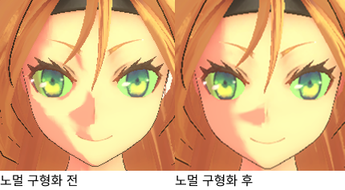
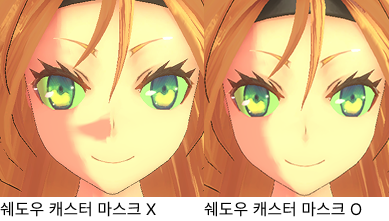
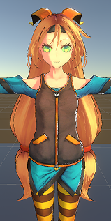

개요
----------------------
**블루 아카이브**나 **붕괴:스타레일**과 같은 턴제 전투 방식을 차용한 3D 수집형 RPG 포트폴리오입니다.

**작동 영상**
https://youtu.be/hgPTH_ZUPj8

목차
---------------------
>1. [**로그인**](#login)<br>
>2. [**전투**](#battle)<br>
>   > [캐릭터 행동 및 스킬](#character)<br>
>3. [**홈**](#home)<br>
>   > [홈 씬 진입](#home_enter)<br>
>   > [모집](#home_recruit)<br>
>   > [아이템 사용](#home_useitem)<br>
>   > [파티 편성](#home_party)<br>
>4. [**확장성**](#expantion)<br>
>   > [캐릭터](#expantion_character)<br>
>   > [스테이지](#expantion_stage)<br>
>   > [아이템](#expantion_item)<br>
>   > [UI](#expantion_ui)<br>
>5. [**카툰 랜더링**](#cartoon-rendering)<br>
>   > [래디언스](#radience)<br>
>   > [노멀 구형화](#normal_spherizing)<br>
>   > [쉐도우 캐스터 마스크](#shadow_caster_mask)<br>
>   > [외곽선](#outline)<br>

기능
---------------------
구현 목표로 한 기능은 다음과 같습니다.

**서버**
> 1. 유저 어카운트 관리(로그인, 재화, 아이템등)<br>
> 2. 캐릭터 관리(캐릭터 획득, 목록 확인, 파티 편성등)<br>
> 3. 전투 개시 및 보상 시스템<br>

**클라이언트**
> 1. 로그인 기능<br>
> 2. 보유 아이템 확인 및 아이템 사용 요청<br>
> 3. 재화및 각종 프로필 확인 기능<br>
> 4. 캐릭터 모집, 편성, 목록 확인 기능<br>
> 5. 전투 기능<br>
> 6. 카툰 랜더링<br>

<a name="login"></a>
로그인
----------------------
  아이디와 비밀번호를 통해 서버에서 JWT를 발급받는 과정입니다. 아이디와 비밀번호를 Body에 담아 서버로 보내면 서버는 ID를 기반으로 유저를 조회해 비밀번호의 일치여부를 판단합니다. 문제가 없을경우 로그인 성공 메세지와 함께 해당 유저의 시크릿 키를 이용해 생성된 JWT를 응답으로 보냅니다. 클라이언트는 이 JWT를 통해 다시 서버에 유저정보를 요청함과 동시에 Home 씬을 로딩합니다. 프로세스를 도식화하면 다음과 같습니다.


<a name="battle"></a>
전투
--------------------
  전투는 플레이어가 선택한 스테이지에 입장하여 플레이어가 설정한 파티를 통해 적을 무찌르고 보상을 받는 과정입니다. 전투는 전투 씬에서 진행되며, 씬에 진입할 때 서버에 현재 스테이지 진입 요청을 하게됩니다. 그러면 서버는 요청의 유효성을 검사하고, 스테이지의 정보를 응답으로 보냅니다. 이 정보를 바탕으로 전투 씬 로드시 스테이지와 적을 생성하여 전투를 진행하고, 스테이지는 각 서브스테이지의 클리어 조건과 스테이지 실패 조건을 검사하기 시작합니다.<br>
  모든 서브스테이지를 클리어하였을 경우, 클라이언트는 서버에 스테이지 성공 요청을 보냅니다. 요청을 받은 서버는 유효성 검사후 데이터베이스의 Stages 클러스터에서 성공 요청을 받은 스테이지를 검색하여 성공 보상을 계산하고, 보상중 Gold와 Jem을 감지하여 플레이어의 재화로 반영합니다. 이후 보상 리스트를 담은 응답을 전송하고, 클라이언트는 스테이지 완료 UI에 이를 표시합니다. 프로세스를 도식화하면 다음과 같습니다.


<a name="character"></a>
#### 캐릭터 행동 및 스킬
  전투에서 캐릭터의 행동은 캐릭터 커맨드를 통해 제어됩니다. 캐릭터 커맨드는 [CharacterCommandBuffer](./Assets/Scripts/Objects/Character/CharacterCommandBuffer.cs)에 정의되어있습니다. 캐릭터 커맨드는 캐릭터의 캐릭터 커맨드 버퍼에 예약되고, 이를 캐릭터가 순차적으로 실행합니다. 캐릭터 커맨드에선 캐릭터의 이동, 애니메이션 재생등을 제어합니다.<br>
  캐릭터마다 스킬은, 캐릭터의 기본공격까지 포함하여 총 4개를 보유하며 [Skill 클래스](./Assets/Scripts/Battle/Skill/Skill.cs)를 상속하여 구현합니다. Skill 클래스는 Cast라는 가상 메서드를 가지고 있으며, 이 Cast 메서드에 해당 스킬의 동작을 구현합니다. 사용자가 UI를 통해 캐릭터의 스킬을 사용하면 [BattleSystem](./Assets/Scripts/System/BattleSystem.cs)에 SkillRequest를 예약하며 BattleSystem은 이 SkillRequest를 순차적으로 Cast합니다. Skill이 Cast되면 시전 캐릭터에 SkillAction과 캐릭터 커맨드를 예약하고, 이 캐릭터 커맨드는 해당 스킬의 애니메이션 재생을 포함합니다. 해당 스킬의 애니메이션이 재생되면 Unity의 애니메이션 이벤트 기능을 통해 캐릭터에 예약된 SkillAction을 실행하고, 여기서 효과나 데미지 처리등을 합니다. 이를 도식화하면 다음과 같습니다.


<a name="home"></a>
홈
--------------------
  홈은 계정의 재화, 아이템, 보유 캐릭터를 확인하거나, 현재 파티의 구성을 변경, 새 캐릭터 모집 및 스테이지를 선택하여 전투씬으로 입장하는 것이 가능한 장소입니다.

<a name="home_enter"></a>
#### 홈 씬 진입
 홈 씬에 진입할 경우, 클라이언트는 서버에 최신의 유저 정보와 글로벌 인포(현재 진행중인 이벤트 등)를 요청합니다. 먼저 로딩씬을 로드하고 유저 정보 요청을 보내며, 유저 정보가 정상적으로 도착하면 글로벌 인포를 요청합니다. 이때, 향후 OpenAPI등의 확장을 고려하여 따로 유효성 검사를 진행하진 않습니다. 이후 해당 정보들을 GameManager에 업데이트한 후, 홈 씬을 로드합니다다. 이를 도식화 하면 다음과 같습니다.
 
 

<a name="home_recruit"></a>
 #### 모집
  홈 씬에서 하단의 메뉴를 통해 모집 UI로 넘어갈 수 있습니다. 현재 진행중인 모집에 Jem을 사용하여 모집을 진행할 수 있으며, 이는 글로벌 인포에 담겨져 있으므로, UI가 로딩될 때 서버로 요청을 보내진 않습니다. 진행중인 모집은 이벤트 코드로 구분하며, 플레이어가 모집을 진행하면 이벤트 코드를 포함하는 모집 요청을 서버로 보냅니다. 그러면 서버는 유효성 검사와 함께 유저의 재화를 검사하며, 유저의 젬이 충분할 경우 서버는 DB에서 요청받은 이벤트를 검색하고, 모집 결과를 산출합니다. 이후 서버는 산출된 모집 결과를 모집후 업데이트된 유저 정보와 함께 응답으로써 클라이언트에 보냅니다. 응답을 받은 클라이언트는 유저 정보를 GameManager에 업데이트하고 모집 컷씬을 재생합니다. 이를 도식화하면 다음과 같습니다.


<a name="home_useitem"></a>
#### 아이템 사용
  모집과 마찬가지로 하단 메뉴를 통해 가방 UI로 넘어갈 수 있으며, 현재 보유한 아이템을 확인하고, 사용가능한 아이템은 사용할 수 있습니다. 인벤토리 정보는 유저 정보에 담겨져 있기 때문에 UI 진입시 서버에 요청을 보내지는 않습니다. 사용가능한 아이템을 확인하게 되면 아이템 확인 UI에 "사용" 버튼이 활성화되고, 이를 클릭시 아이템 사용 요청을 서버로 보냅니다. 서버는 유효성 검사후 아이템 사용 처리를 하고, 결과 메세지와 업데이트된 유저 정보를 응답으로 반환합니다. 이를 받은 클라이언트는 UI에 결과 메세지를 띄우고, GameManager에 유저 정보를 업데이트합니다. 이를 도식화하면 다음과 같습니다.


<a name="home_party"></a>
#### 파티 편성
  모집, 가방과 마찬가지로 하단 메뉴를 통해 캐릭터 UI로 넘어갈 수 있으며, 여기서 좌측 버튼을 통해 파티 편성 UI로 넘어갈 수 있습니다. 파티는 최대 네명의 캐릭터로 구성될수 있습니다. 파티 편성 UI의 각 자리 버튼을 클릭하면 캐릭터 선택 UI가 활성화 되며, 배치할 캐릭터를 클릭하면 서버로 파티 편성 요청을 보냅니다. 이 요청에는 변경된 자리의 인덱스와 변경한 캐릭터 정보를 담고 있으며, 서버는 이를 받아서 유효성 검사후 유저 정보를 업데이트합니다. 이후, 업데이트된 유저 정보를 응답으로 보내며, 클라이언트는 이를 받아 유저 정보를 업데이트하고 파티 편성 UI를 갱신합니다. 이를 도식화 하면 다음과 같습니다.


<a name="expantion"></a>
확장성
--------------------
  온라인 서비스를 상정한 게임이므로 향후 확장성을 고려하여 시스템을 디자인했습니다. 게임내 확장 가능한 모든 컨텐츠를 일정한 프로세스에 맞춰 추가할 수 있도록 하는 것이 최우선시한 목표이며, 또한, 그 과정에서 코드를 쓰는 과정을 최대한 적게 하는것이 두번째 목표였습니다.

<a name="expantion_character"></a>
#### 캐릭터
캐릭터는 스테이지에 등장하여 전투를 하는 아군/적군을 총칭하며 [Character 클래스](./Assets/Scripts/Objects/Character/Character.cs)를 통해 구현합니다.

#### AnimatedCharacter
[AnimatedCharacter 클래스](./Assets/Scripts/Objects/Character/AnimatedCharacter.cs)는 Animator 컴포넌트와 상호작용하는 컴포넌트이며, Character클래스가 CharacterAsset을 참조하여 Prefab을 생성할 때, 생성된 GameObject에 붙습니다. 수행하는 기능은 다음과 같습니다.
> 1. 스킬의 효과를 나타내는 SkillAction을 순차적으로 처리<br>
> 2. 캐릭터 모델의 애니메이션을 재생<br>
> 3. 애니메이션 재생이 끝났을 경우 AnimationEndCallback을 통해 Character에 전달<br>
> 4. 해당 Character가 사용하는 Animator를 GetAnimator를 통해 반환

이는 유니티 애니메이션의 Event 기능이 Animator가 붙은 GameObject를 기준으로 하므로 Character 클래스를 분리해놓은 것 입니다.

#### 새로운 캐릭터 제작 프로세스
> 1. 캐릭터로 사용할 모델, 애니메이션 데이터를 준비하고, 해당 캐릭터용 AnimatorController를 생성<br>
> 2. 애니메이션 클립에 Event를 설정<br>
> 3. AtentsPro > CharacterAsset을 생성하고 이 데이터를 바인딩<br>
> 4. 데이터베이스의 Characters 콜렉션에 해당 캐릭터의 데이터 작성<br>
> 5. 캐릭터의 스킬 4개를 기획하여 Resources/DataSheet/SkillTable.csv에 작성<br>
> 6. 기획을 바탕으로 Skill 클래스를 상속한 캐릭터의 스킬 클래스 제작<br>
> 7. SkillBuilder 스태틱 클래스에 해당 스킬의 코드로 스킬의 객체를 생성하는 코드 추가<br>
> 8. 스킬의 아이콘을 제작하고 아틀라스로 묶음<br>
> 9. 해당 캐릭터의 초상화와 전신 일러스트를 제작<br>

<a name="expantion_stage"></a>
#### 스테이지
스테이지는 [Stage 클래스](./Assets/Scripts/Battle/Stage/Stage.cs)를 상속하여 구현합니다.  [StageTable](./Assets/Resources/DataSheet/StageTable.csv)에 각 스테이지에 대한 정보를 저장하고있습니다. [StageEditor 클래스](./Assets/Scripts/Editor/Battle/StageEditor.cs)를 제작하여 스테이지 제작시에 GUI를 사용하여 보다 빠르고 효율적으로 제작할 수 있도록 하였습니다.

**Substage**는 스테이지를 구성하는 작은 스테이지들입니다. 아군들과 적들이 위치할 포지션에 대한 정보와 등장하는 적들의 정보를 담고있습니다. 여기서 적들의 정보는 Resources/DataSheet/StageTable.csv에 저장되어있으나, 실제로는 클라이언트 변조를 예방하기 위하여 전투 개시시에 서버에 요청하여 받아옵니다.

#### 새로운 스테이지 제작 프로세스
> 1. 게임 오브젝트를 생성하고 Stage 컴포넌트를 추가<br>
> 2. 스테이지 환경을 조성<br>
> 3. SpawnPos를 추가하고 GUI를 통해 위치를 설정<br>
> 4. Substage를 추가하고 GUI를 통해 teamPos및 enemyPos를 설정<br>
> 5. 게임 오브젝트를 프리팹으로 제작<br>
> 6. 데이터베이스 Stages 클러스터에 해당 Stage를 추가하고, enemies및 rewards 설정<br>
> 7. 데이터베이스 Users 클러스터에 원하는 유저의 enableStages에 해당 Stage를 추가<br>
> 8. Resources/DataSheet에 해당 스테이지의 정보를 추가<br>
> 9. Resources/Texture/Illustration/StagePreveiw에 Stage의 프리뷰 이미지를 제작해서 저장<br>

<a name="expantion_item"></a>
#### 아이템
아이템은 캐릭터가 가방 UI에서 확인하거나 사용할 수 있는 요소입니다. 아이템의 정보는 [ItemTable](./Assets/Resources/DataSheet/ItemTable.csv)에 저장되어있으며, 아이디, 이름, 설명, 사용가능 여부로 구성됩니다

#### 새로운 아이템 제작 프로세스
> 1. Resources/DataSheet/ItemTable.csv에 아이템 정보 추가
> 2. Resources/Texture/ItemIcon에 아이템 아이콘 텍스쳐를 제작하여 추가
> 3. 사용가능한 아이템일 경우 Server/AtentsServer.js에 아이템 사용 요청시 처리될 함수를 추가
> 4. 해당 함수를 UserItem 메서드 분기에 추가

<a name="expantion_ui"></a>
#### UI
게임의 UI는 [UINavigatable](./Assets/Scripts/UI/UINavigatable.cs)를 상속받아 구현하며, UINavigatable가 붙은 UGUI GameObject를 [UINavigationSystem](./Assets/Scripts/System/UINavigationSystem.cs)이 관리합니다. UINavigation에서는 UINavigatable을 등록하고, 해당 UI의 State를 지정할 수 있습니다.<br>


또한 UINavigationSystem에는 [UINavStatemachine](./Assets/Scripts/UI/UINavStatemachine.cs)을 등록할 수 있습니다. UINavStatemachine는 각 State들의 연결을 설정할 수 있는 ScriptableObject입니다. UINavigationSystem은 등록된 UINavStatemachine을 참조하여 State를 이동하며, 다른 State로 이동할 때 연결되지 않은 State로는 이동할 수 없습니다. State를 이동하게되면 이전 State에 소속된 UINavigatable들의 "StateOff" 메서드를 실행하고, 다음 State에 소속된 UINavigatable들의 "StateOn" 메서드를 실행합니다.<br>


#### 새로운 UI 제작 프로세스
> 1. 씬 뷰에서 UGUI를 통해 UI를 디자인
> 2. UINavigatable를 상속한 Mono 컴포넌트를 제작
> 3. 디자인한 UI 최상단 오브젝트에 제작한 컴포넌트를 붙여넣기
> 4. UINavStatemachine 에셋에 States 요소를 추가 및 연결 설정
> 5. UINavigationSystem에 UINavigatables 요소를 추가하고 게임 오브젝트와 State를 할당

<a name="cartoon-rendering"></a>
카툰 랜더링
--------------------------
  원하는 게임 분위기를 내기위해 캐릭터에 사용될 카툰 쉐이더를 제작하였습니다. 목표는 일러스트풍의 카툰 쉐이딩 제작이었으며, URP에서 제공하는 기능을 십분 활용하기 위하여 URP의 Universal Lit 쉐이더를 복사하여 PBR 부분을 NPR 스타일로 교체하는 작업을 통해 구현하였습니다.

<a name="radience"></a>
#### 래디언스
  부드러운 셀 셰이딩을 얻기위하여, 램프 텍스쳐를 샘플링하는것 보다 Threshold값과 Smooth값을 사용하여 래디언스값을 계산하는 편이 비용이 덜 들것으로 판단되어 해당 방법으로 셀 쉐이딩을 구현하였습니다. 다음은 래디언스 값을 계산한 코드입니다.
```hlsl
smoothstep(Threshold - Smooth, Threshold + Smooth, x)
```
래디언스는 그림자 뿐만 아니라 프레넬과 스펙큘러에도 적용될 수 있으며, one-step 셀 쉐이딩과 비교하면 아래와 같습니다.<br>


<a name="normal_spherizing"></a>
#### 노멀 구형화
  래디언스를 통해 부드러운 셀 셰이딩을 얻었지만, 아직 그림자가 지저분합니다. 이는 대부분의 일러스트에서, 특히, 캐릭터의 얼굴쪽 명암이 단순하게 표현되는게 원인임을 알 수 있습니다.<br>


이를 표현하기 위해 표면의 노멀을 구에 가깝게 펴서 보다 단순한 명암을 얻는 방법을 고안했으며, 구의 기준이 될 월드 좌표를 GPU로 넘겨주고 실제 표면과 기준 좌표를 기준으로 그린 구의 노멀을 일정한 계수 만큼 보간하여 얻은 구형화된 노멀을 얻습니다. 아래는 구형화된 노멀을 얻는 코드입니다.
```hlsl
float3 centerToSurface = normalize(positionWS - vertexAveragePos);
float3 spherizedNormal = lerp(normalWS, centerToSurface, x);
```
여기서 positionWS와 normalWS는 각각 표면의 월드 좌표에서의 위치와 노멀이며, vertexAveragePos는 구의 중심의 월드 좌표 위치입니다. 구의 노멀은 단순히 구의 중심을 시점, 표면의 월드 좌표를 종점으로 하는 벡터로 계산합니다. x는 구형화 계수이며, 1에 가까울수록 노멀이 구에 가깝게 나옵니다.<br>


비교 사진에서 좀 더 단순화된 명암을 확인할 수 있습니다.

<a name="shadow_caster_mask"></a>
#### 쉐도우 캐스터 마스크
  얼굴의 코와 같이 다른 부위에 비해 과하게 튀어나온 부분이 있으면, 주변 표면에 그림자를 드리웁니다. 이 현상은 얼굴과 같은 시각적으로 민감한 부위에 나타나게되면 목표로 하는 일러스트 느낌이 크게 저해된다고 생각했으며, 이를 해결하는 방법을 모색했습니다.<br>


단순히 외부 그림자를 받지 않도록 하는것은 나무나 돌과 같은 환경 요소에 의해 드리우는 그림자도 없어지기에 부자연스럽습니다. 이에 마스크 텍스쳐를 통해 메시의 특정 부분이 그림자 맵에 랜더링될 때 클리핑하여 그림자를 캐스팅하지 않도록하는 방법을 고안했고, ShadowCasterPass를 커스텀하여 쉐도우 캐스터 마스크를 구현했습니다.

<br>
<사용된 UnityChan 모델의 쉐도우 캐스터 마스크>



<a name="outline"></a>
#### 외곽선
  캐릭터의 외곽선은 URP에서 동작하는 SRP Batcher가 multi-Pass 쉐이더를 지원하지 않기에 외곽선 쉐이더를 따로 제작하여 MeshRenderer에 두 개의 머티리얼을 적용하는 방식으로 구현하였습니다.<br>

